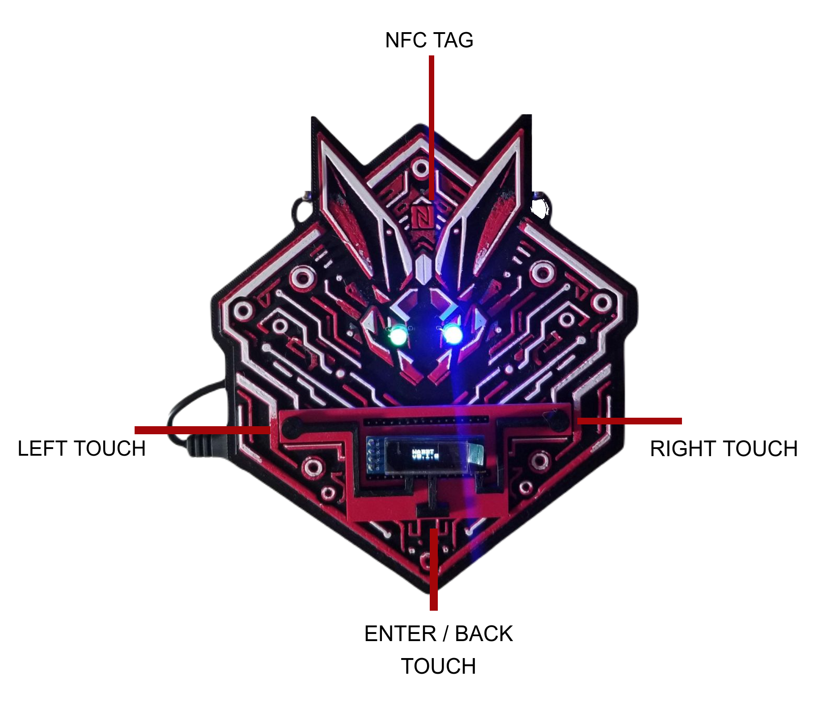
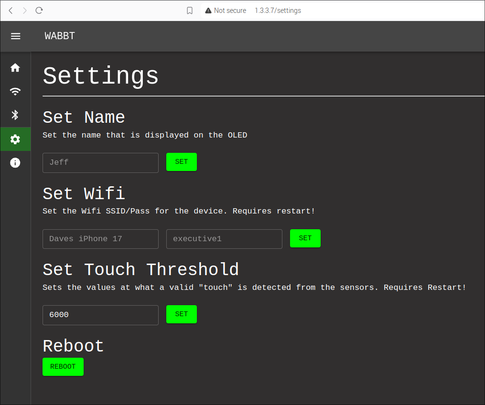
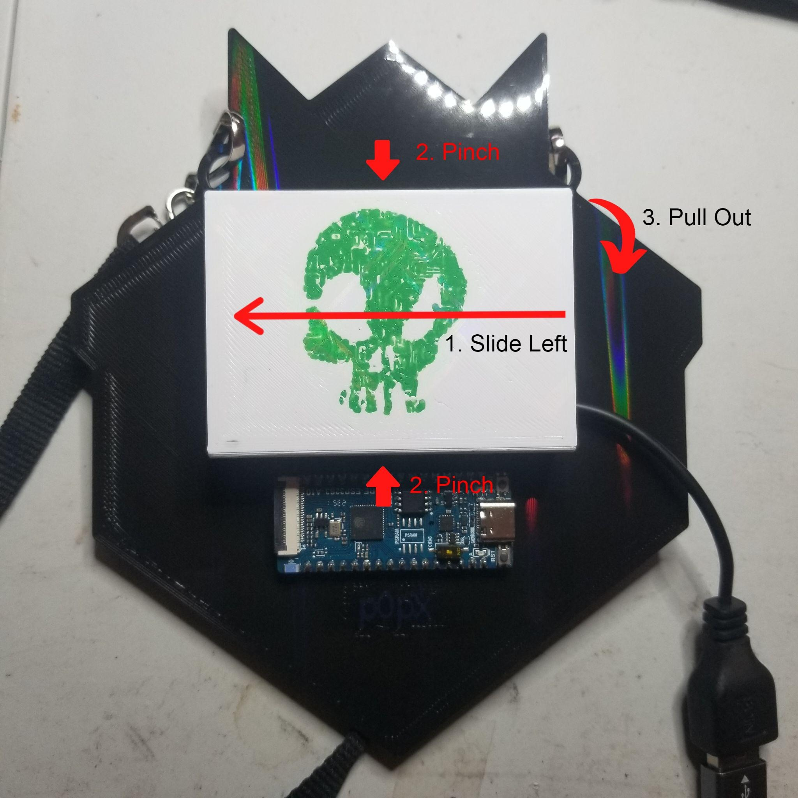

# WABBT (Wifi & Bluetooth Badge Tool)

A ESP32-S3 powered Wifi/BLE Tool that is housed in 3D printed badge.



[toc]

## Physical Features
  * ESP32-S3 Development Board
  * OLED Screen
  * 2x Neopixel RGB lights
  * NFC Tag - Writable Block0
  * Built in circuit
  * 3D printed battery case/pack + usb -> usb3 connector
  * 3D printed conductive touch pads

## Firmware Features
  * Web UI or with touchpads / screen controls
  * WiFi Tools
    - Deauth
    - Deauth Detect
    - PMKID
  * BLE Tools
    - BLE MITM aka Gatt Attack (I will separate this into another project as well)
    - AirTag / Tracker Detector (Smart Tagger) - can set off audio alert for AirTag
    - Fake Drone - Sends spoofed OpenDroneID packets over BLE to spoof a drone flying around
    - Skimmer Detector - sparkfun research gave some advertisements to lookout for known gas station skimmers
    - Name Spam - Overwhelm "trackers" with tons of fake macs/advertisments
    - FastPair Spam - Google FastPair - not super reliable - ported from the recent BLE Adv popup spammers
    - EasySetup Spam - Samsung - not super reliable - ported from the recent BLE Adv popup spammers
    - Spam Detector - Detect above + other advertisment spams
    - vHCI - Talk directly with the Bluetooth controller over the UI websocket

## Instructions

The badge can either be controlled via the touch pads or using the WiFi UI interface. It is recommended to immediately connect to the wifi and configure the badge to your liking and change the WiFi credentials.

### Physical Controls

Left & Right touchpads work as expected and will cycle the currently displayed "view"

The main views the OLED screen shows are from left to right:

Name Display <-> WiFi Menu <-> BLE Menu <-> Settings

The center "Enter/Back" touch button will enter into one of the menus if tapped. Once inside a menu or an "app" you can press and hold the "Enter/Back" button to stop, cancel, or go back up a level in the view.

WiFi/BLE Menus each have different apps you can use.

In the settings on the OLED you can see the currently set WiFi credentials or view the reading of the touch sensors for debugging.

### Connect to WiFi

The default WiFi creds are:

```
ssid: WABBIT_WIFI
pass: WABBT1234
```

If this does not work check the WiFi info in settings for the correct credentials.

Once you are connected you can click this [friendly link](http://1.3.3.7) to access the Web UI.

### Web UI Setup

Go to the settings Icon on the left hand side of the webpage and set the Badge's Name Display that is shown on the OLED and edit your WiFi credentials to your liking. If you need to edit the touch sensor reading feel free to as well. Make sure to click the reboot button after.



Connect to the new network you just setup and head back [to the UI](http://1.3.3.7) to fully utilize your badge.

### NFC

This badge features a magic NFC (MIFARE Classic 1k) tag. These tags have a writeable block 0 so you can change the UID, which is perfect for making clones. Or for a more general usage my recommendation is to use the "NFC Tools" app found on your mobile phone's app store to write your contact information.

### Serial

Logging and information can be viewed over serial baud `115200`

### Battery Replacement

To "unlock" the battery pack holder you need to slide the pack to the left and pinch in the middle. This should allow you to pull it out.



To put it back you need to have the holder on the left and angled at the top or bottom slots. Pinch the middle and press the opposite side down then slide to the right to "lock" it.

**USE 3x AA Lithium Ion batteries**

## Updates

The easiest way to update will be to get the files from the `Firmware/build/` folder and flash with the following command:

```
esptool.py -p (PORT) -b 460800 --before default_reset --after hard_reset --chip esp32s3  write_flash --flash_mode dio --flash_size detect --flash_freq 80m 0x0 Firmware/build/bootloader/bootloader.bin 0x8000 Firmware/build/partition_table/partition-table.bin 0xe000 Firmware/build/ota_data_initial.bin 0x10000 Firmware/build/wabbt.bin 0xc90000 Firmware/build/spiffs.bin
```

Be sure to replace **PORT**

## Pro Mode: Compile
  * Install VSCode
  * Install ESP-IDF Extension
  * Setup IDF and use version 5.1.3
  * `cd ~/esp/v5.1.3/esp-idf/`
  * `git apply bad_blues.patch` - Apply bad blues patch to esp to get gatt attack to work properly
  * Open repo folder in VSCode
  * `git submodule update --init`
  * `cd Firmware/components/ESPAsyncWebServer && git apply ../../../espasyncwebserver.patch`
  * Edit `Firmware/partitions.csv` if you dont have 16mb flash ESP
  * In VSCode `Terminal -> Run Build Task`
  * Now you should be able to use 'flash' lightening symbol on bottom bar
  * After flash you can monitor using the button on bottom bar
  * Any of the other ESP VSCode Plugin buttons will now work including the build,flash,monitor command

## Print Info

Autodesk and CAD files are inside this repo. The print information can be found on [Makerworld](https://makerworld.com/en/models/672277#profileId-600119).

```
Printer: Bambu X1C
Print Time: ~5h
Ciruit Build Time: 15mins
Circuit Implant Time: 5mins
NFC Implant Time: ~1min
Post Processing: 30mins

Total Build Time: ~5.55h, 5h print/55mins manual labor
```

## Bugs / TODO
* TODO (low): gatt attack 
  - Sometimes when using the tool and the web ui
    an exception "assert failed: tlsf_free tlsf.c:1120 (!block_is_free(block) && "block already marked as free")" related to the asyncwebsocketclient
* BUG (very low): AsyncWebSocket sometimes on boot webserver will come up fast but then 
there is a long period of time until the websock actually connects.

## Disclaimer

I am not responsible for how this firmware is used. This is intended for research and educational purposes only. You agree to not use any of this code or design assets for commercial purposes without my written permission.